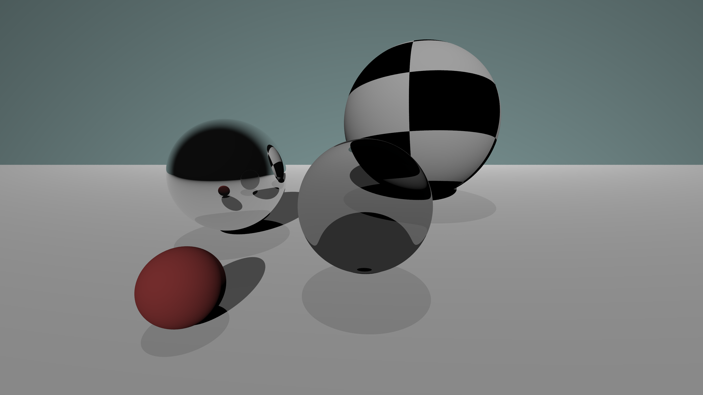

## Ray tracer in Rust

This is a toy ray tracer written in Rust, mostly for teaching myself the fundamentals.
Currently it implements basic diffuse shading, reflection, refraction, Fresnel equations, basic material types, basic lighting. There is *a lot more* to work on, so the whole software might change over time.

Here is an example render:
</img>
